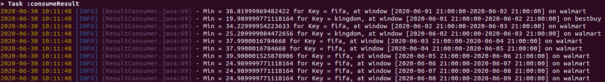

# Price Monitor [WIP]

## Overview
The idea behind this experiment is to implement a scalable Price Monitoring solution using Scrapy, Kafka and Kafka Streams. 

Basically, we want to scrape specific product data from multiple online retailers (like walmart.com, bestbuy.com, amazon.com, etc), send it to a Kafka topic using Avro serialization, and then a Kafka Streams application will be analyzing the incoming stream of products from multiple stores to identify the best price among all the retailers in a given time-window.
For this example, we chose to analyze two retailers (walmart.com and bestbuy.com), for two consoles games: FIFA '20 and Kingdom Hearts.

Our solution will analyze the data on a daily basis because we are feeding the Kafka topic with data that was previously extracted daily, but you can choose the size of the time-window for any value that you want.

Below is an image showing the output from the monitoring tool:

## Project structure

## Requirements

## How to run

### Kafka cluster

Talk about the Confluent Cloud platform (the easiest to go).

### Kafka Streams application

### Scrapy (producer)
